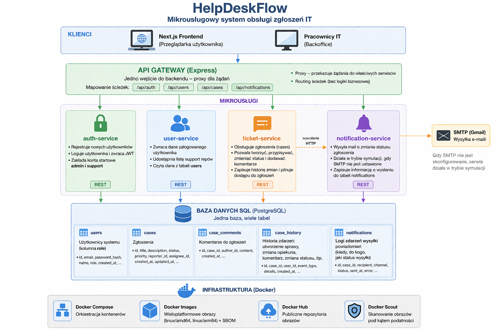
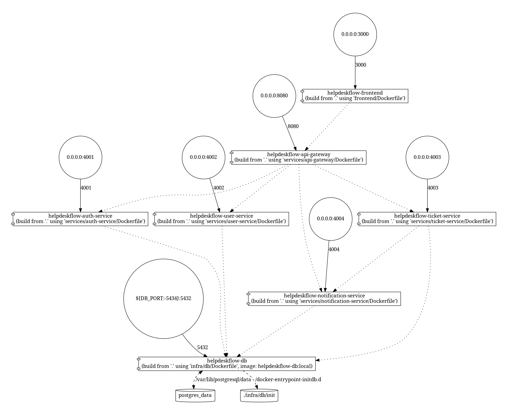
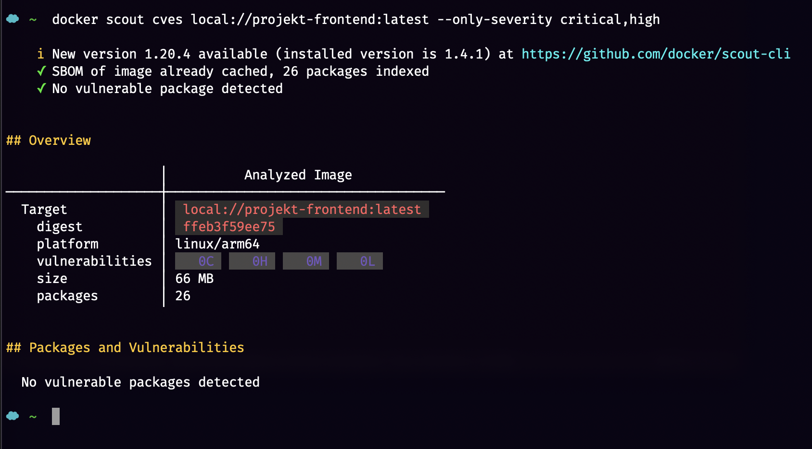
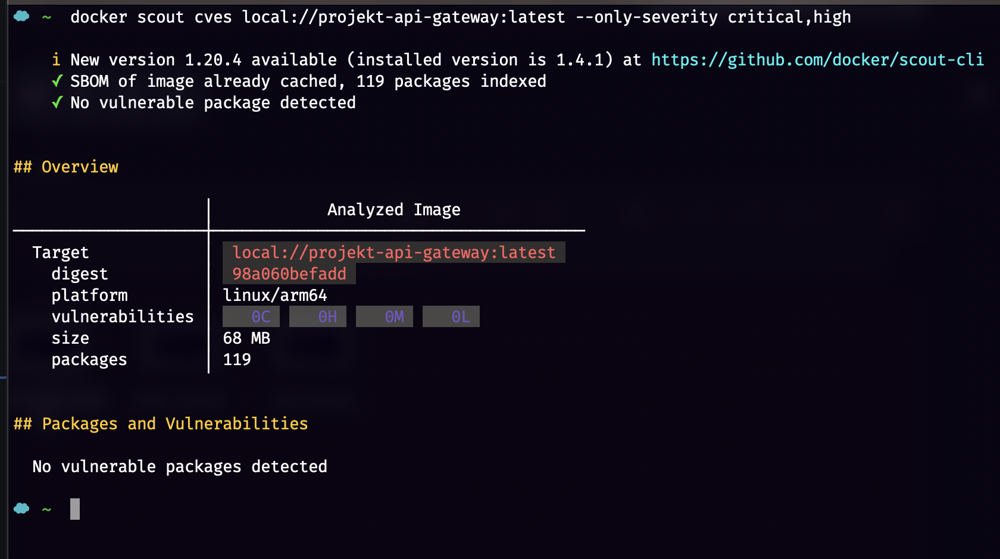
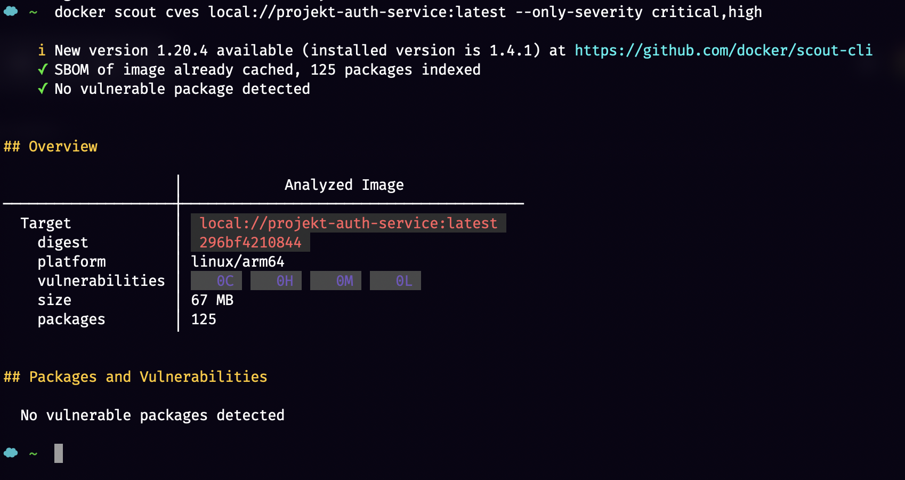
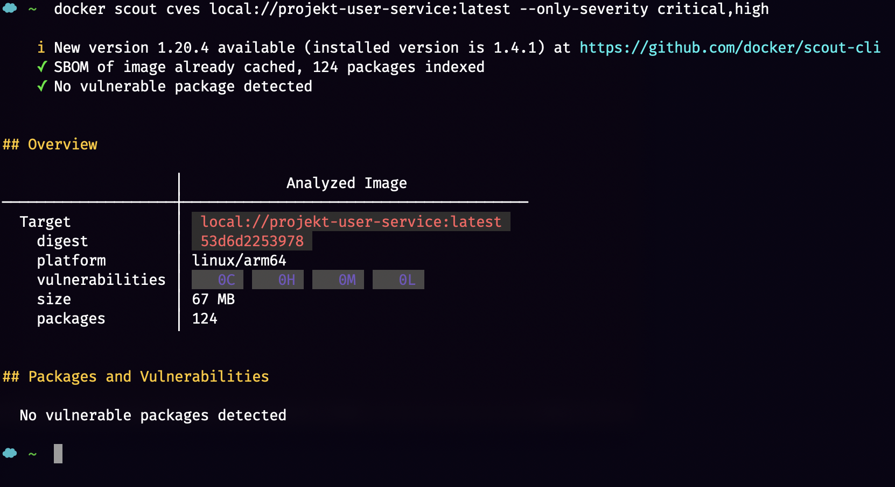
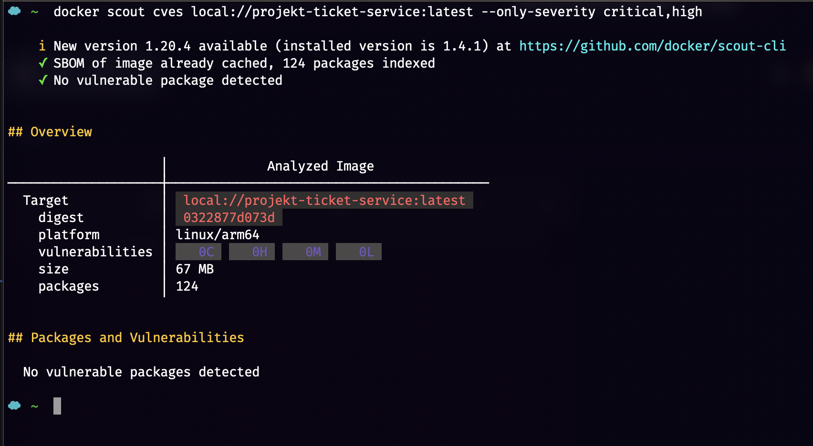
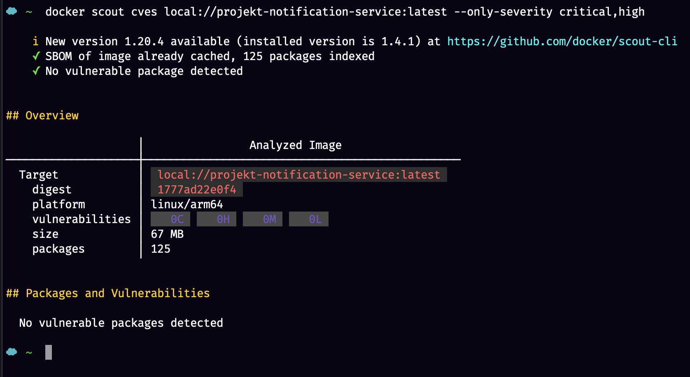
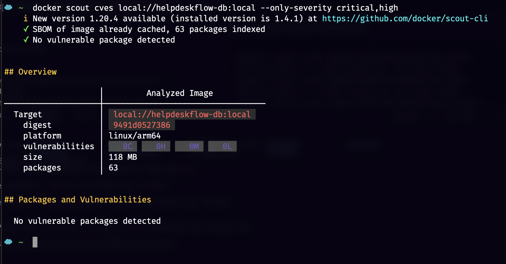

# Project for the CI/CD Process Security course

## Project Links

- GitHub repository: [SiKret100/HelpDeskFlow](https://github.com/SiKret100/HelpDeskFlow)
- Docker Hub - frontend: [dawidrut01/helpdeskflow-frontend](https://hub.docker.com/r/dawidrut01/helpdeskflow-frontend)
- Docker Hub - API Gateway: [dawidrut01/helpdeskflow-api-gateway](https://hub.docker.com/r/dawidrut01/helpdeskflow-api-gateway)
- Docker Hub - Auth Service: [dawidrut01/helpdeskflow-auth-service](https://hub.docker.com/r/dawidrut01/helpdeskflow-auth-service)
- Docker Hub - User Service: [dawidrut01/helpdeskflow-user-service](https://hub.docker.com/r/dawidrut01/helpdeskflow-user-service)
- Docker Hub - Ticket Service: [dawidrut01/helpdeskflow-ticket-service](https://hub.docker.com/r/dawidrut01/helpdeskflow-ticket-service)
- Docker Hub - Notification Service: [dawidrut01/helpdeskflow-notification-service](https://hub.docker.com/r/dawidrut01/helpdeskflow-notification-service)

## Overview



HelpDeskFlow is a microservices-based IT help desk application prepared for the CI/CD and systems security course. The system allows end users to register and log in, create support cases, add comments, and follow status changes. IT staff can review incoming cases, assign support representatives, update statuses, and trigger email notifications.

The application is containerized with Docker Compose and uses a shared PostgreSQL database. The backend is split into focused services, while the frontend is built with Next.js and communicates with the backend through a single API Gateway.

## Microservices



- [Frontend](./frontend): Next.js user interface available on `http://localhost:3000`.
- [API Gateway](./services/api-gateway): Express-based entry point that proxies requests to `/api/auth`, `/api/users`, `/api/cases`, and `/api/notifications`.
- [Auth Service](./services/auth-service): Registers users, verifies credentials, issues JWT tokens, and seeds default `admin` and `support` accounts.
- [User Service](./services/user-service): Returns the current user profile and exposes the list of support representatives.
- [Ticket Service](./services/ticket-service): Handles support cases, comments, assignee changes, status changes, and case history.
- [Notification Service](./services/notification-service): Sends status change emails through Gmail SMTP or works in simulation mode if SMTP is not configured. The current SMTP integration is a temporary solution for this stage of the project and is not the final version of the notification connection.
- **Database (PostgreSQL)**: Shared SQL database storing `users`, `cases`, `case_comments`, `case_history`, and `notifications`.
- [Database Image](./infra/db/Dockerfile): Local hardened Postgres image used by Docker Compose; it keeps the official init flow and replaces the vulnerable `gosu` helper with `su-exec`.
- **Gmail SMTP**: External mail provider used by the Notification Service for real email delivery.

All application services have custom Dockerfiles, and the final images were published to Docker Hub under the `dawidrut01` namespace. The submission tag is `v0.1.2`, and the images support both `linux/amd64` and `linux/arm64` with SBOM attestation generated by `buildx`. The database is built locally by Docker Compose from [infra/db/Dockerfile](./infra/db/Dockerfile).

## Docker Image Security

The final public images used for submission are:

- `dawidrut01/helpdeskflow-frontend:v0.1.2`
- `dawidrut01/helpdeskflow-api-gateway:v0.1.2`
- `dawidrut01/helpdeskflow-auth-service:v0.1.2`
- `dawidrut01/helpdeskflow-user-service:v0.1.2`
- `dawidrut01/helpdeskflow-ticket-service:v0.1.2`
- `dawidrut01/helpdeskflow-notification-service:v0.1.2`

According to the final Docker Scout verification, every image in the `v0.1.2` set reports `0C 0H`. The full verification log is available in [docs/docker-scout-report.md](./docs/docker-scout-report.md).

To reach this state, the final runtime images were pinned to `node:22.22.2-alpine`, unnecessary package manager binaries were removed from the runtime layers, and the frontend was converted to a static export served by a lightweight static server.

The PostgreSQL image needed an extra hardening step. The upstream `postgres:17-alpine3.22` image currently reports `1C 8H` in Docker Scout because of the bundled `gosu` binary compiled with a vulnerable Go standard library. In this repository, Docker Compose builds a local replacement image `helpdeskflow-db:local` from [infra/db/Dockerfile](./infra/db/Dockerfile), swaps `gosu` for `su-exec`, and keeps the official `/docker-entrypoint-initdb.d` initialization flow unchanged.

### Safety of Frontend image



`dawidrut01/helpdeskflow-frontend:v0.1.2` reports `No vulnerable package detected`.

### Safety of API Gateway image



`dawidrut01/helpdeskflow-api-gateway:v0.1.2` reports `No vulnerable package detected`.

### Safety of Auth Service image



`dawidrut01/helpdeskflow-auth-service:v0.1.2` reports `No vulnerable package detected`.

### Safety of User Service image



`dawidrut01/helpdeskflow-user-service:v0.1.2` reports `No vulnerable package detected`.

### Safety of Ticket Service image



`dawidrut01/helpdeskflow-ticket-service:v0.1.2` reports `No vulnerable package detected`.

### Safety of Notification Service image



`dawidrut01/helpdeskflow-notification-service:v0.1.2` reports `No vulnerable package detected`.

### Safety of Database image



The database image used by Docker Compose is `helpdeskflow-db:local`, built from [infra/db/Dockerfile](./infra/db/Dockerfile).

- upstream base image `postgres:17-alpine3.22`: `1C 8H 12M 2L 6?`
- local hardened image `helpdeskflow-db:local`: `0C 0H 2M 1L 1?`

The remaining findings after hardening are medium, low, and unspecified issues in Alpine packages that currently do not have upstream fixes according to Docker Scout.

## Getting Started

To get started with the project, follow the steps below:

1. Clone the repository:

   ```bash
   git clone https://github.com/SiKret100/HelpDeskFlow.git
   cd HelpDeskFlow
   ```

2. Create the required environment files:

   ```bash
   cp .env.example .env
   cp frontend/.env.local.example frontend/.env.local
   ```

3. If you want to send real emails from Gmail, fill in the SMTP settings in `.env`:

   ```env
   SMTP_USER=your-gmail-address@gmail.com
   SMTP_PASS=your-gmail-app-password
   SMTP_FROM=HelpDeskFlow <your-gmail-address@gmail.com>
   ```

   If SMTP is not configured, `notification-service` will still work in simulation mode and will save delivery events in the `notifications` table.
   The current SMTP connection is not the final version and will be further integrated and refined in the next part of the project.

4. Install dependencies:

   ```bash
   npm install
   ```

5. Launch the full stack with Docker Compose:

   ```bash
   npm run docker:up
   ```

6. The application will be available at:

   - frontend: `http://localhost:3000`
   - API Gateway: `http://localhost:8080`
   - auth-service: `http://localhost:4001`
   - user-service: `http://localhost:4002`
   - ticket-service: `http://localhost:4003`
   - notification-service: `http://localhost:4004`
   - PostgreSQL on the host: `localhost:5434`

## Default Accounts

The following accounts are created automatically on startup by `auth-service`:

- support representative:
  - email: `support@helpdeskflow.local`
  - password: `Support123!`
- administrator:
  - email: `admin@helpdeskflow.local`
  - password: `Admin123!`

A regular end user can register directly from the frontend.

## Useful Commands

```bash
npm run docker:logs
npm run docker:stop
npm run docker:down
npm run docker:publish
npm run docker:inspect
```

For local development outside Docker:

```bash
npm run dev
```

## Additional Documentation

- [docker-compose.yml](./docker-compose.yml)
- [docs/credentials.md](./docs/credentials.md)
- [docs/docker-scout-report.md](./docs/docker-scout-report.md)
- [docs/dockerhub-guide.md](./docs/dockerhub-guide.md)
- [docs/manual-dockerhub-sbom-guide.md](./docs/manual-dockerhub-sbom-guide.md)
- [docs/compose-viz.svg](./docs/compose-viz.svg)
- [docs/compose-viz.png](./docs/compose-viz.png)
- [infra/db/Dockerfile](./infra/db/Dockerfile)
